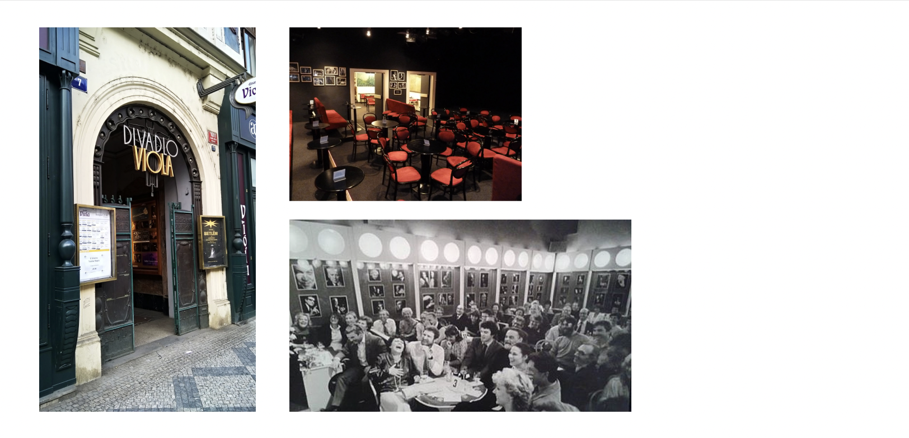
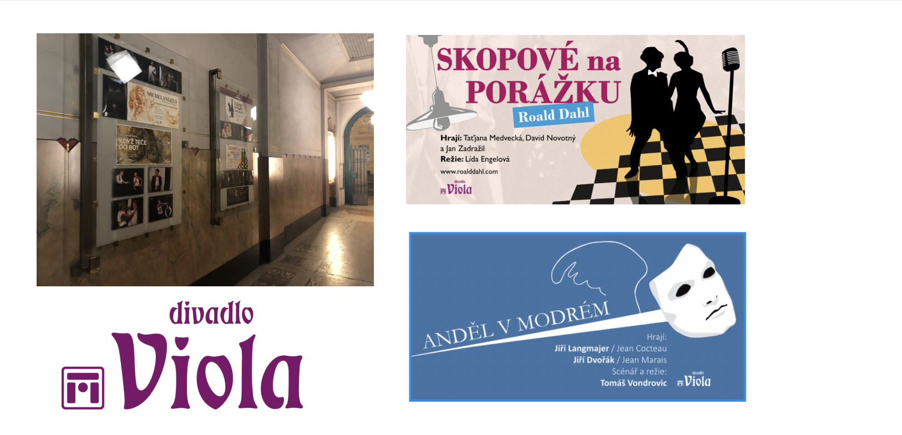
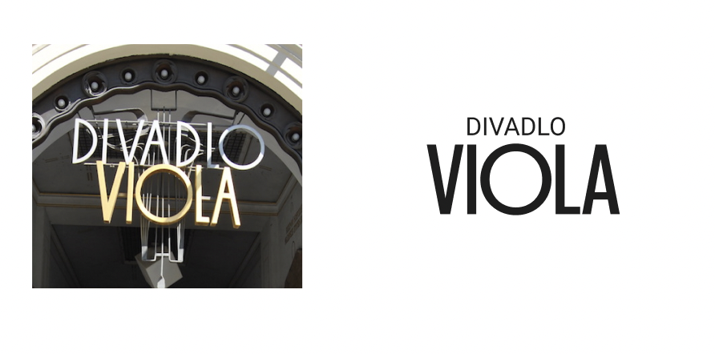
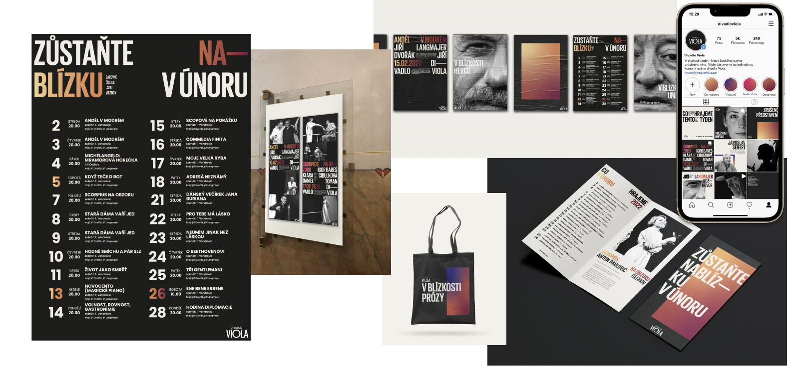

# Rebrand of Viola Theatre
## November-January 2022 
Ideation, identity, branding, social media strategy, print layouts

We worked with the small but very significant Prague Viola theatre located on Národní třída. The theatre is focused on chamber performances inspired by literary texts. The place was important in the 70s when it served as a poetic vinery for intellectuals and artists.

Oval entrance of Viola Thatre and the interior now and in the 70s

Visual communication  has become more and more fragmented and neglected over time. The client’s request was to upgrade communication to be more attractive and united. A logo, website, all printed materials, and a social media strategy was required. The main goal was to appeal to younger viewers, but also not to offend the usual older visitors. You can see the original communication below. 

Original logo with some other exaples of original visual identity

We decided to enhance special aspects of the theater in our design solution. We focused on unique closeness to the artists and the beauty of the Czech language. As logo we used the original typeface at the entrance.

Logo from the entrance and our facelifted version

We used a little play with close typography to express clossenes and intimity in the theatre. We used taglines" Be even closer to us in January" on the program. The colors, that I particularly enjoyed, are in the form of warm gradients. These are inspired by theater lights and atmosphere with emotions during the performance. Overview of our design application.

Overview of our design application

We hope our design and marketing choices are attractive and accessible for all age groups. The new way to work with social media can rise the awareness of the brand among younger client.  that are no less interested in theatre.

My role in the team of three (together with Jan Jiráček and Eunice Sojková)was to focus on the strategy of social media, printed programs, and finding main idea.

This project was in its creative freedome surprisingly challenging.
Our team felt often overwhelmed with inspiration and ideas until  we found a strong communication story.
