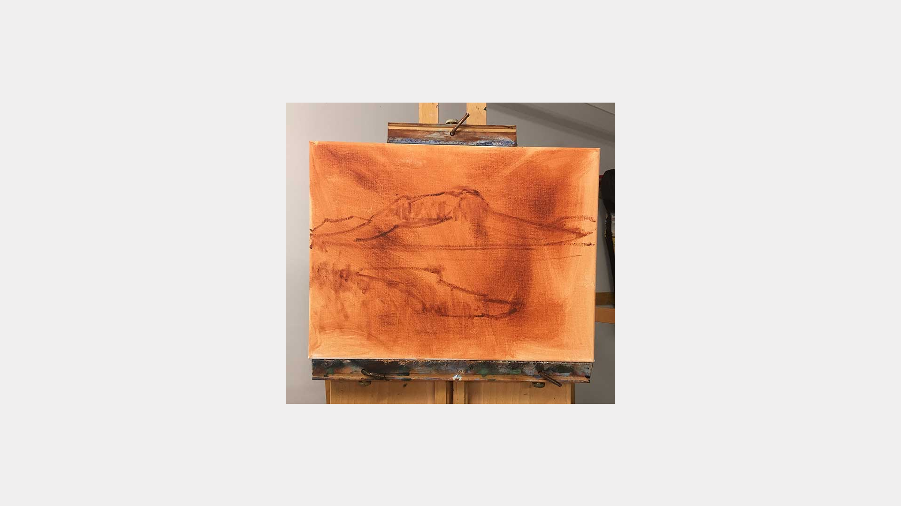
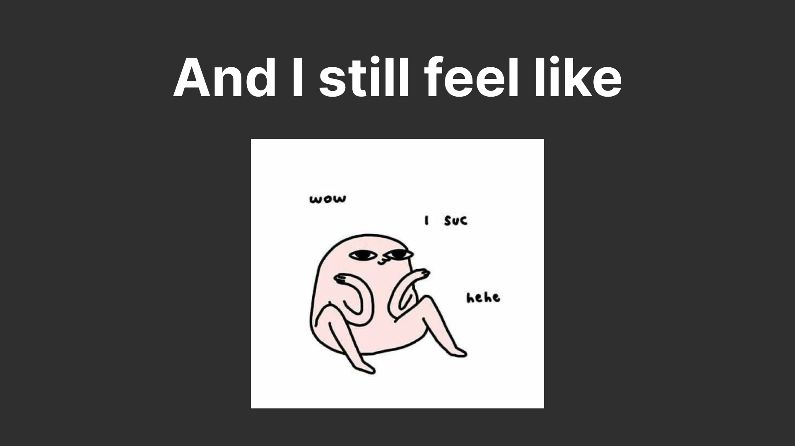
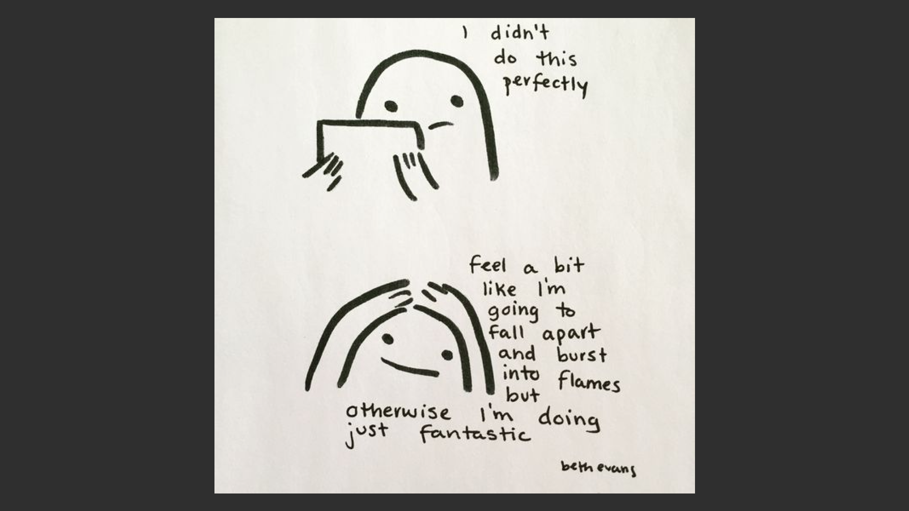

# Few things I’ve learned as a designer

by Anna Vokounová

- View 💬 [figma slides](https://www.figma.com/proto/0N8ElwgWVoWV3GnkLCClg8/Talk?page-id=0%3A1&node-id=0-14&starting-point-node-id=0%3A14)
- View ✏️ [the process](process.md) <!-- Preparation, show and tell your process; think, case study. -->

Here is a transcript of the presentation 👇🏼

## Few things I’ve learned as a designer
When I was asked to think of a story to share, I thought to myself What could I possibly share that would be somehow useful to you? I am a junior designer currently pursuing my bachelor's year so I was thinking that I could summon and kind of reflect on things that I’ve learned during my professional design journey.

| |

|:--:|
|*First layer of oil painting*|

Maybe some of you have experience with oil painting.
My professor in high school learned me that this is the correct technique to paint the first layers. This technique I told you about surely has a painting logic behind it but it also helps get rid of the scary empty whiteness. It is messy, weird, and frustrating, full of trial and error, and ultimately incomplete depiction of what the final piece will be.
I think that the first layers are a lot like your 20s. It's mostly a mess and trying to figure it out but as first layers, they are crucial for the integrity and foundation of the work and even the most gracious works have them. But sometimes even this doesn’t bring me comfort and I still feel like this sometimes I still suck. But I think that`s normal. Let me tell you why…

|  

|:--:|
|*Beanie*|

Last summer I went to work full-time in the design studio which was pretty much my first real design experience. And these were my thoughts pretty much all the time. Some time passed and I started to be a little bit more comfortable and I gain some confidence in what I am doing. I love the book called Why has nobody told me this before by famous clinical psychologist Julie Smith. She wrote that gaining confidence comes from going somewhere where you have no confidence at all. Confidence is like a home that you have to build, when you go somewhere else you have to build a new one but every time you  start with a better foundation than before and it eventually gets easier. And I think that the point of not only our 20s but our whole life is to continuously build these little houses by learning and practicing new things.

### So what stands in our way (well, at least in mine)?

I give you an example from my normal life when I was meant to prepare for my very first yoga class. I had crystal clear ideas of how it should go and what people should get from my class. I wanted it to be like a safe space where you throw behind all ideas about how the poses should look and allow yourself just try and be your imperfect you. As I encouraged people to lose the judging voice in their heads, mine on the other hand began to feel like a war mighty general who was not going to cut me any slack anytime soon. So I was the right example of not practicing what I was preaching. I think this picture says it all. As you might guess I am talking about perfectionism.

|  |

|:--:|
|*Perfectionism captured in one picture*|

To clarify perfectionism is not the same thing as striving to be your best. Perfection is not about healthy achievement and growth but most likely pressures us to think that we have to be perfect on all occasions and otherwise, we are not worth it or our work is not worth it when it is not according to our standards. So how this can manifest in the creative process? Yes right…it can crush it, sabotage it, or in the best-case scenario, it can take all fun out of it. The overwhelming fear of not getting it right sometimes may stand in the way of even starting. Sometimes solid perfectionists take an excessive amount of time to complete a task that does not typically take others long to complete. As a result, they may focus less on the process of learning and completing a task to the best of their ability.

Once I attended this class for creating expressive characters illustration because I thought I will make use of it for my thesis. And it was so much fun and I loved it. For the first time in a very long time, I felt free when creating something and I didn't judge my work afterward. There were some kinds of exercises like doing a scribble and making a character out of it, drawing people from the street, and simultaneously forgetting about anatomy rules and exaggerating features.The reason why I loved so much to draw these silly figures was mainly that process fights my perfectionist urges.
Here is something that I took from it and keep in mind since then. Don't worry too much about the outcome or at least that much.
Try to shut up that negative self-talk even if it’s hard. Sometimes you don’t have time or you are not into it and that’s the magic of doing things just to get them done. I do this usually with a timer. I set a timer and do what I can so I can feel like I gave it time I did my best in that time slot and that’s all that this task deserves. This helps me also with neglecting the rest of my life. And of course, you can always edit it later, it is nice because now you have SOMETHING TO EDIT(that is important). And finally, the one that affected me the most. You are not your work. Your work doesn’t define your value. And it is still worth it even if it is not perfect.

So I will encourage you similarly like in that yoga class, but today I will listen to it too. If some of us are sometimes experiencing similar struggles as I am, be brave, be brave to be bad at something, and make mistakes. You are not alone in this. The thing is when you chose to be brave over perfect, you create a space that would not otherwise be there. You create a space for something that might not be perfect but can be awesome. And maybe you will build yourself another little house of confidence. 🥹❤️
