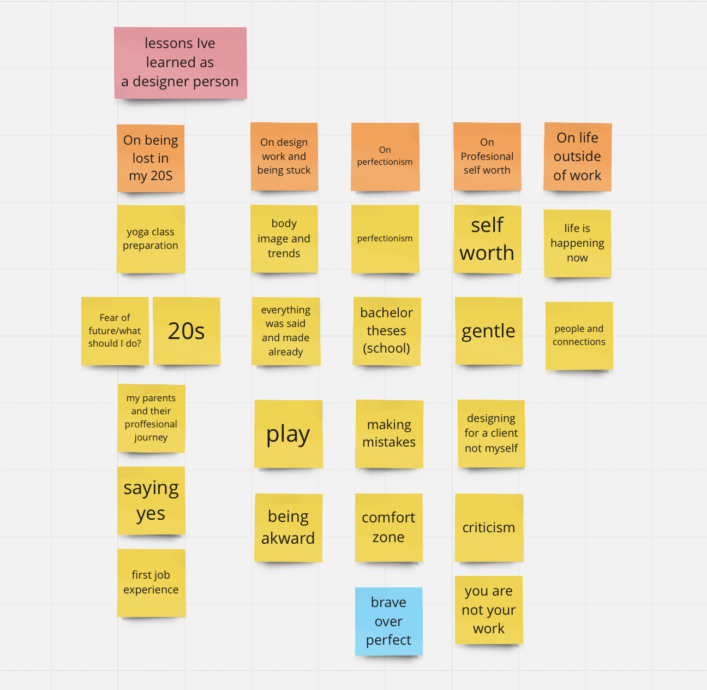

# Working Title Goes Here
## Process

- Read [the article](…) <!-- index.md -->

<!-- Treat this as the case study to your article/talk/presentation. Document, discuss, and show your process (mind maps, chunking, draft and revised content, links to resources, etc.) -->
<!-- Preparing a conference talk: https://adactio.com/journal/14363 -->
<!-- A refresher about case studies: https://thegymnasium.com/courses/take5/taking-your-portfolio-case-studies-to-the-next-level

I started similarly like from the talk about Web design,I just put everyhing on the paper.

