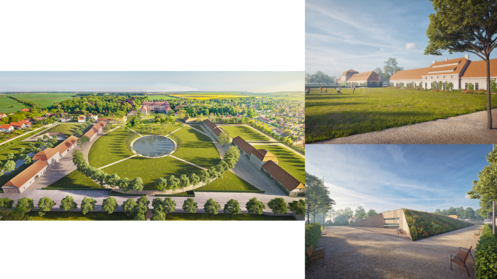
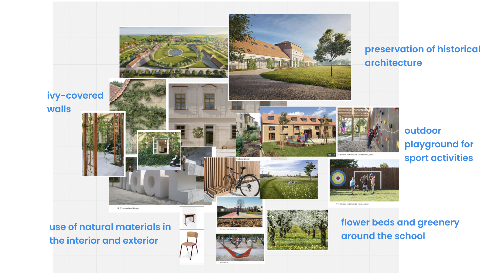
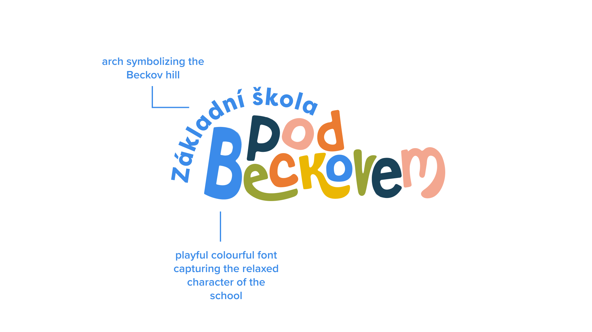
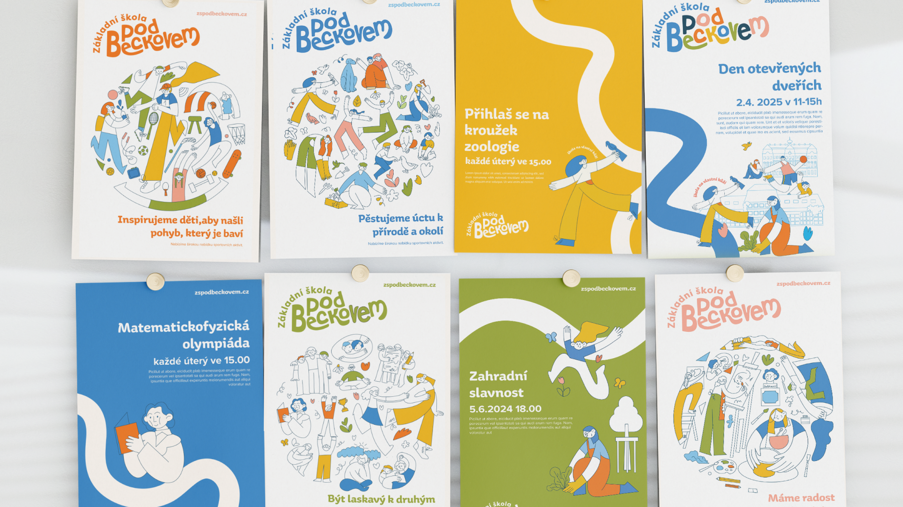
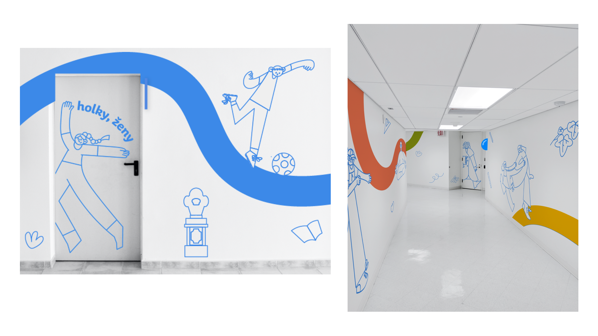

# 🎓 Thesis presentation

## Visual Identity for Elementary School in the village 

by Anna Vokounová

- View 📁[figma slides](https://www.figma.com/proto/10tEkcuKMj7xXKM9MsBymw/thesis-presentation?page-id=0%3A1&type=design&node-id=5-15477&viewport=313%2C639%2C0.02&scaling=min-zoom&starting-point-node-id=1%3A638)

### About the project
The project was created due to insufficient school capacity in the area. The founder is the municipality association Pod Beckovem including my hometown Měšice, where the school will be located. 
The school building will be created by restoring the farm buildings in the castle ground. 
Fully equipped self-sufficient primary school with 9 classrooms for 300 children.
 

### Concept development and visuals
This visual concept is all about the illustrations and the joyful color scheme. The main goal was to create a positive identity that also refers sensitively to the village of Měšice. It uses Josef Dobrovsky's personality as the executing person,because of his historical connection to the place. His image appears as part of the other illustrations or on its own. In addition to depictions of pupil characters and school life, there are graphic bands of colour that not only offer planes for illustration, but also represent symbolic and physical paths that pupils can take at school as a closer profiling of a child's interests and character.

### Result and takeaway
Besides being fun because of the illustration, it was also personal since I included my hometown and tried to capture its spirit. 
I hope that when I look back I will be proud and glad that I chose this topic. The completed visual style proposal I will submitt to the municipality of Měšice as a possible proposal to use. I would be happy for further follow-up cooperation on its real implementation if this proposal is chosen. There is also the possibility of cooperating with residents and, specifically, parents of future pupils of this school.
